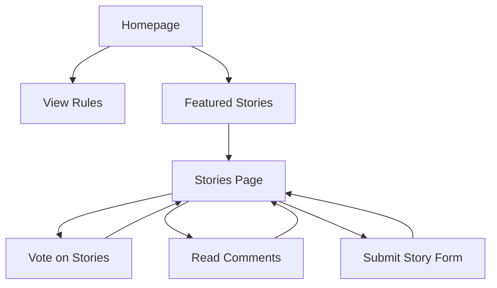

## 1. Product Overview
FL (Free Life) is a personal integrated website that celebrates freedom and liberated lifestyle through storytelling and community interaction. The platform enables users to share personal experiences about freedom and growth while fostering meaningful discussions in a respectful, open environment.

Target users include individuals seeking inspiration for personal freedom, those wanting to share life experiences, and community members interested in motivational content about growth and liberation.

## 2. Core Features

### 2.1 User Roles
| Role | Registration Method | Core Permissions |
|------|---------------------|------------------|
| Visitor | No registration required | Browse stories, read comments, vote on content |
| Contributor | Optional name/email submission | Submit stories, comment on posts, participate in discussions |

### 2.2 Feature Module
The FL website consists of the following main pages:
1. **Homepage**: Hero section with personal introduction, site rules section, featured stories preview
2. **Stories page**: Grid layout of all submitted stories with voting and comment counts
3. **Submit Story page**: Form for users to share personal experiences about freedom and growth
4. **Contact page**: Simple contact information and messaging option

### 2.3 Page Details
| Page Name | Module Name | Feature description |
|-----------|-------------|---------------------|
| Homepage | Hero Section | Display personal introduction with circular profile photo, name placeholder 'John Doe', brief bio about background and site purpose, centered layout with blue-to-white gradient background |
| Homepage | Rules Section | Present 5-7 community rules in card-based layout with Font Awesome liberty-themed icons (birds, keys), including respectful comments, no spam, personal stories aligned with freedom themes |
| Homepage | Featured Stories | Preview section showing latest or top-voted stories with brief excerpts |
| Stories | Story Grid | Display all submitted stories in responsive grid layout with image placeholders, vote counts, comment counts, and author information |
| Stories | Voting System | Upvote/downvote functionality with animated freedom bird icons that fly on click, real-time counter updates, persistent vote tracking via localStorage |
| Stories | Comments Section | Threaded comment system with user avatars, timestamps, reply functionality, styled as modern forum interface |
| Submit Story | Submission Form | Form fields for story title, story text (encouraging freedom/growth themes), optional name and email, client-side validation, modal or clean form styling with submit button animation |
| All Pages | Navigation | Fixed top navbar with 'FL - Free Life' logo, links to Home, Rules, Stories, Submit Story, Contact, including search functionality for stories |

## 3. Core Process
**Visitor Flow:**
1. Land on Homepage → View hero introduction and site rules
2. Browse to Stories page → Explore submitted stories
3. Vote on stories → Click animated voting buttons
4. Read comments → Expand comment threads
5. Submit own story → Navigate to submission form

**Contributor Flow:**
1. Access Submit Story page → Fill out story submission form
2. Submit story → Story appears in Stories grid
3. Engage with community → Comment on other stories
4. Track engagement → View votes and comments on own stories

## 4. User Interface Design

### 4.1 Design Style
- **Primary Color**: Sky blue (#87CEEB) representing open skies and freedom
- **Secondary Colors**: White (#FFFFFF) for clean backgrounds, Green (#228B22) for growth accents
- **Typography**: Montserrat for headings, Lato for body text (Google Fonts)
- **Button Style**: Rounded corners with smooth hover transitions
- **Layout**: Card-based design with Bootstrap 5 grid system
- **Icons**: Font Awesome liberty-themed icons (birds, keys, open symbols)
- **Animations**: Fade-in on page load, smooth hover effects, animated voting buttons

### 4.2 Page Design Overview
| Page Name | Module Name | UI Elements |
|-----------|-------------|-------------|
| Homepage | Hero Section | Centered circular profile photo with hover zoom effect, gradient background from sky blue (#87CEEB) to white, tagline 'Embrace Freedom in Every Story' in Montserrat font |
| Homepage | Rules Cards | Bootstrap card layout with Font Awesome icons, accordion-style expandable sections, sky blue accent borders |
| Stories | Story Grid | Responsive grid (3 columns desktop, 1 column mobile), card shadows on hover, freedom-themed placeholder images, vote counters with animated bird icons |
| Submit Story | Form Modal | Clean white background, sky blue accent buttons, smooth form validation feedback, success animation on submission |
| Navigation | Top Navbar | Fixed position with glassmorphism effect, 'FL - Free Life' logo in Montserrat bold, search bar with icon integration |

### 4.3 Responsiveness
Desktop-first design approach with mobile adaptation. Bootstrap 5 ensures responsive behavior across all devices. Touch interaction optimization for mobile voting and comment interactions.

### 4.4 Accessibility
ARIA labels for all interactive elements, keyboard navigation support, high contrast text readability, screen reader compatible form labels and button descriptions.