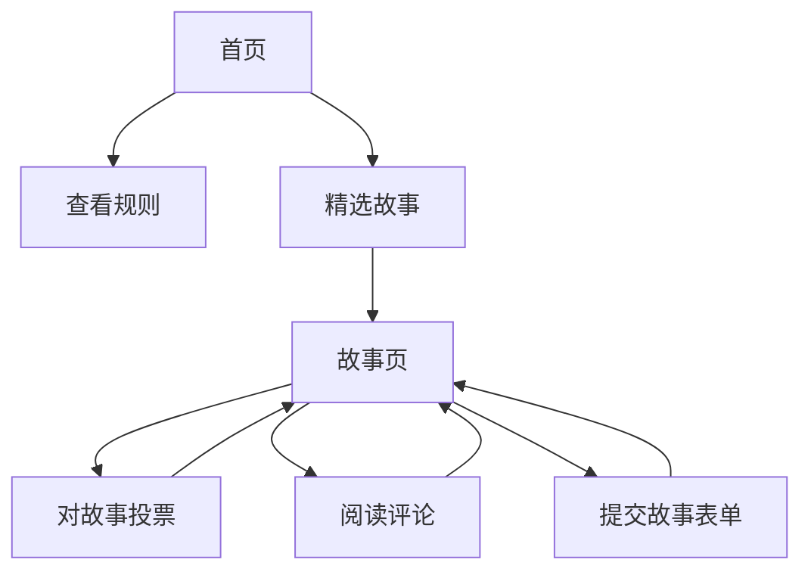

## 1. 产品概述
FL (Free Life) 是一个个人综合网站，通过讲故事和社区互动来颂扬自由和解放的生活方式。该平台允许用户分享关于自由和成长的个人经历，同时在一个尊重、开放的环境中促进有意义的讨论。

目标用户包括寻求个人自由灵感的个人、希望分享生活经历的人，以及对成长和解放相关的励志内容感兴趣的社区成员。

## 2. 核心功能

### 2.1 用户角色
| 角色 | 注册方式 | 核心权限 |
|------|----------|----------|
| 访客 | 无需注册 | 浏览故事，阅读评论，对内容进行投票 |
| 贡献者 | 可选的姓名/邮箱提交 | 提交故事，评论帖子，参与讨论 |

### 2.2 功能模块
FL 网站包含以下主要页面：
1. **首页 (Homepage)**：包含个人介绍的英雄区域 (Hero section)，网站规则区域，精选故事预览
2. **故事页 (Stories page)**：以网格布局显示所有提交的故事，带有投票和评论计数
3. **提交故事页 (Submit Story page)**：用户分享关于自由和成长的个人经历的表单
4. **联系页 (Contact page)**：简单的联系信息和消息选项

### 2.3 页面详情
| 页面名称 | 模块名称 | 功能描述 |
|----------|----------|----------|
| 首页 | 英雄区域 | 显示个人介绍，包含圆形头像、占位符名称 "John Doe"、关于背景和网站目的的简短简介，采用从蓝色到白色的渐变背景居中布局 |
| 首页 | 规则区域 | 以卡片布局展示 5-7 条社区规则，使用 Font Awesome 自由主题图标（鸟、钥匙），包括尊重的评论、无垃圾信息、个人故事需符合自由主题 |
| 首页 | 精选故事 | 预览区域，显示最新或投票最高的故事及其简短摘要 |
| 故事页 | 故事网格 | 以响应式网格布局显示所有提交的故事，包含图片占位符、投票数、评论数和作者信息 |
| 故事页 | 投票系统 | 支持赞成/反对功能，点击时有飞翔的自由鸟图标动画，实时更新计数，通过 localStorage 持久化投票记录 |
| 故事页 | 评论部分 | 盖楼式评论系统，包含用户头像、时间戳、回复功能，采用现代论坛界面风格 |
| 提交故事页 | 提交表单 | 包含故事标题、故事正文（鼓励自由/成长主题）、可选姓名和邮箱的字段，客户端验证，模态框或简洁表单样式，带有提交按钮动画 |
| 所有页面 | 导航栏 | 固定顶部导航栏，带有 "FL - Free Life" Logo，链接到首页、规则、故事、提交故事、联系我们，包含故事搜索功能 |

## 3. 核心流程
**访客流程：**
1. 进入首页 → 查看英雄介绍和网站规则
2. 浏览至故事页 → 探索提交的故事
3. 对故事投票 → 点击动画投票按钮
4. 阅读评论 → 展开评论楼层
5. 提交自己的故事 → 导航至提交表单

**贡献者流程：**
1. 访问提交故事页 → 填写故事提交表单
2. 提交故事 → 故事出现在故事网格中
3. 与社区互动 → 评论其他故事
4. 追踪参与度 → 查看自己故事的投票和评论

## 4. 用户界面设计

### 4.1 设计风格
- **主色调**：天蓝色 (#87CEEB) 代表开阔的天空和自由
- **辅助色**：白色 (#FFFFFF) 用于干净的背景，绿色 (#228B22) 作为代表成长的点缀
- **排版**：标题使用 Montserrat，正文使用 Lato (Google Fonts)
- **按钮风格**：圆角，带有平滑的悬停过渡效果
- **布局**：基于 Bootstrap 5 网格系统的卡片式设计
- **图标**：Font Awesome 自由主题图标（鸟、钥匙、开放符号）
- **动画**：页面加载淡入，平滑悬停效果，动画投票按钮

### 4.2 页面设计概览
| 页面名称 | 模块名称 | UI 元素 |
|----------|----------|---------|
| 首页 | 英雄区域 | 居中的圆形头像带悬停缩放效果，从天蓝色 (#87CEEB) 到白色的渐变背景，Montserrat 字体标语 "Embrace Freedom in Every Story" |
| 首页 | 规则卡片 | Bootstrap 卡片布局，带 Font Awesome 图标，手风琴式可展开部分，天蓝色边框点缀 |
| 故事页 | 故事网格 | 响应式网格（桌面端 3 列，移动端 1 列），悬停时卡片阴影，自由主题占位图，带动画鸟图标的投票计数器 |
| 提交故事页 | 表单模态框 | 干净的白色背景，天蓝色点缀按钮，平滑的表单验证反馈，提交时的成功动画 |
| 导航栏 | 顶部导航 | 固定位置带玻璃拟态效果，Montserrat 粗体 "FL - Free Life" Logo，集成搜索栏 |

### 4.3 响应式设计
移动优先的设计方法，适配桌面端。Bootstrap 5 确保跨设备响应行为。针对移动端投票和评论交互的触摸优化。

### 4.4 无障碍设计
所有交互元素添加 ARIA 标签，支持键盘导航，高对比度文本可读性，兼容屏幕阅读器的表单标签和按钮描述。
