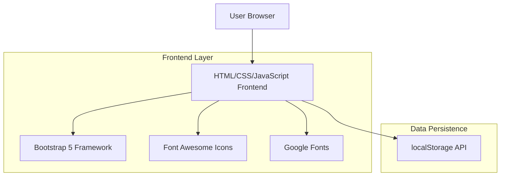
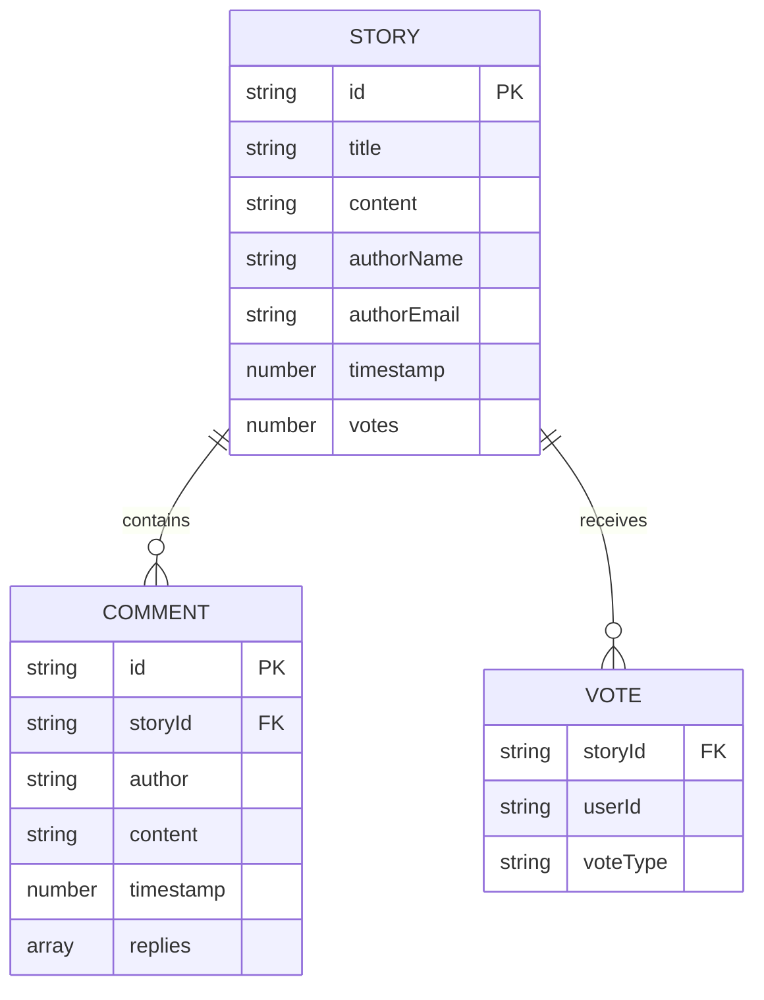

## 1. Architecture design



## 2. Technology Description
- Frontend: HTML5 + CSS3 + Vanilla JavaScript
- CSS Framework: Bootstrap 5.3.0
- Icons: Font Awesome 6.4.0
- Fonts: Google Fonts (Montserrat + Lato)
- Data Storage: Browser localStorage API
- Build Tool: None (pure frontend implementation)

## 3. Route definitions
| Route | Purpose |
|-------|---------|
| /index.html | Homepage with hero section, rules, and featured stories |
| /stories.html | Stories page displaying all submitted stories in grid layout |
| /submit.html | Story submission form page |
| /contact.html | Contact information page |

## 4. API definitions

### 4.1 localStorage Data Structures

**Stories Storage**
```javascript
// Key: 'fl_stories'
[
  {
    id: string,
    title: string,
    content: string,
    authorName: string,
    authorEmail: string,
    timestamp: number,
    votes: number,
    userVotes: object, // { userId: 'up'|'down' }
    comments: array
  }
]
```

**Comments Structure**
```javascript
{
  id: string,
  storyId: string,
  author: string,
  content: string,
  timestamp: number,
  replies: array
}
```

### 4.2 JavaScript Functions

**Story Management**
```javascript
// Load all stories
function loadStories() 

// Save story to localStorage
function saveStory(storyData)

// Update story votes
function updateStoryVote(storyId, voteType, userId)

// Add comment to story
function addComment(storyId, commentData)
```

**UI Functions**
```javascript
// Render stories grid
function renderStoriesGrid(stories)

// Render voting buttons with animations
function renderVotingButtons(storyId, votes, userVote)

// Render comments thread
function renderComments(storyId, comments)

// Show form validation
function validateForm(formData)
```

## 5. Server architecture diagram
No server-side architecture required. All functionality implemented client-side with localStorage for data persistence.

## 6. Data model

### 6.1 Data model definition


### 6.2 localStorage Implementation

**Stories Collection**
```javascript
// Initialize storage
const stories = JSON.parse(localStorage.getItem('fl_stories')) || [];

// Story object structure
const story = {
  id: generateUniqueId(),
  title: "My Journey to Freedom",
  content: "Personal story about liberation and growth...",
  authorName: "Anonymous",
  authorEmail: "",
  timestamp: Date.now(),
  votes: 0,
  userVotes: {},
  comments: []
};
```

**Vote Tracking**
```javascript
// User vote tracking to prevent duplicate voting
const userVotes = JSON.parse(localStorage.getItem('fl_user_votes')) || {};

// Vote structure
const voteRecord = {
  storyId: story.id,
  voteType: 'up', // 'up' or 'down'
  timestamp: Date.now()
};
```