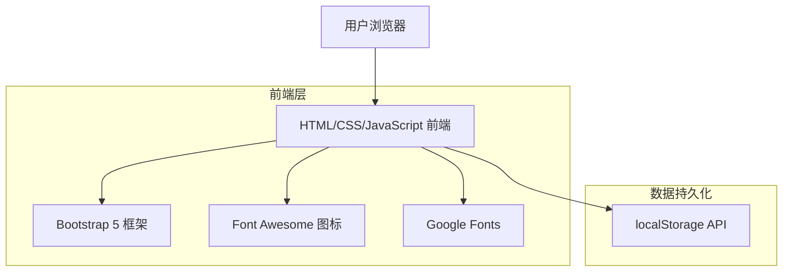
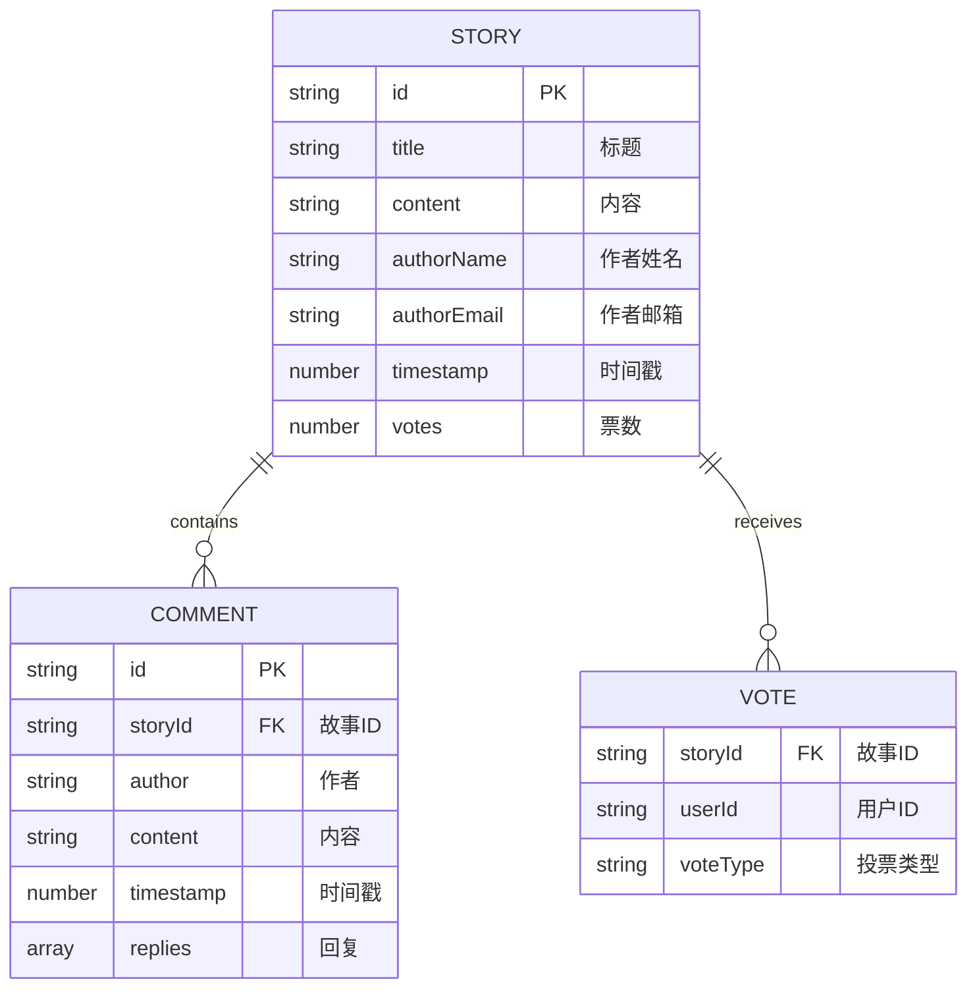

## 1. 架构设计



## 2. 技术栈描述
- 前端：HTML5 + CSS3 + 原生 JavaScript (Vanilla JavaScript)
- CSS 框架：Bootstrap 5.3.0
- 图标：Font Awesome 6.4.0
- 字体：Google Fonts (Montserrat + Lato)
- 数据存储：浏览器 localStorage API
- 构建工具：无 (纯前端实现)

## 3. 路由定义
| 路由 | 用途 |
|------|------|
| /index.html | 首页，包含英雄区域、规则和精选故事 |
| /stories.html | 故事页，以网格布局显示所有提交的故事 |
| /submit.html | 故事提交表单页 |
| /contact.html | 联系信息页 |

## 4. API 定义

### 4.1 localStorage 数据结构

**故事存储 (Stories Storage)**
```javascript
// Key: 'fl_stories'
[
  {
    id: string,
    title: string, // 标题
    content: string, // 内容
    authorName: string, // 作者姓名
    authorEmail: string, // 作者邮箱
    timestamp: number, // 时间戳
    votes: number, // 票数
    userVotes: object, // { userId: 'up'|'down' } 用户投票记录
    comments: array // 评论数组
  }
]
```

**评论结构 (Comments Structure)**
```javascript
{
  id: string,
  storyId: string, // 关联的故事ID
  author: string, // 作者
  content: string, // 内容
  timestamp: number, // 时间戳
  replies: array // 回复数组
}
```

### 4.2 JavaScript 函数

**故事管理 (Story Management)**
```javascript
// 加载所有故事
function loadStories() 

// 保存故事到 localStorage
function saveStory(storyData)

// 更新故事投票
function updateStoryVote(storyId, voteType, userId)

// 添加评论到故事
function addComment(storyId, commentData)
```

**UI 函数 (UI Functions)**
```javascript
// 渲染故事网格
function renderStoriesGrid(stories)

// 渲染带有动画的投票按钮
function renderVotingButtons(storyId, votes, userVote)

// 渲染评论楼层
function renderComments(storyId, comments)

// 显示表单验证
function validateForm(formData)
```

## 5. 服务器架构图
无需服务器端架构。所有功能均在客户端实现，使用 localStorage 进行数据持久化。

## 6. 数据模型

### 6.1 数据模型定义


### 6.2 localStorage 实现

**故事集合 (Stories Collection)**
```javascript
// 初始化存储
const stories = JSON.parse(localStorage.getItem('fl_stories')) || [];

// 故事对象结构
const story = {
  id: generateUniqueId(),
  title: "My Journey to Freedom",
  content: "Personal story about liberation and growth...",
  authorName: "Anonymous",
  authorEmail: "",
  timestamp: Date.now(),
  votes: 0,
  userVotes: {},
  comments: []
};
```

**投票追踪 (Vote Tracking)**
```javascript
// 用户投票追踪，防止重复投票
const userVotes = JSON.parse(localStorage.getItem('fl_user_votes')) || {};

// 投票记录结构
const voteRecord = {
  storyId: story.id,
  voteType: 'up', // 'up' (赞成) 或 'down' (反对)
  timestamp: Date.now()
};
```
